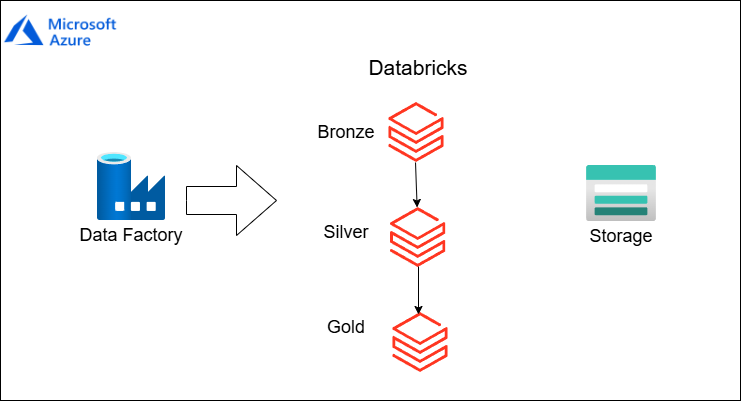

# 🚀 Data Pipeline with Azure DataFactory + Databricks + Azure Storage

The proposed architecture presents a modern solution for data pipeline orchestration using leading market technologies:

- **Orchestration**: Apache Azure DataFactory for workflow management
- **Processing**: Azure Databricks for layered transformations (Bronze, Silver, Gold)
- **Storage**: Azure Storage (Data Lake) + Delta Lake
- **Governance**: Unity Catalog for Silver and Gold layers

  

---

## About the Architecture

This project's architecture uses **Azure DataFactory** to orchestrate notebook execution in **Azure Databricks**. These notebooks are responsible for processing data in three layers:

### 🔸 Bronze Layer
- Ingestion of raw data from API: [https://api.openbrewerydb.org](https://api.openbrewerydb.org)
- Writing to .json files in Azure Data Lake

### 🔹 Silver Layer
- Structuring raw data with geographic partitioning
- Writing to Delta tables in Unity Catalog

### 🟡 Gold Layer
- Data aggregation and analytical-ready datasets
- Delta tables managed via Unity Catalog

The primary storage is implemented through **Azure Storage** integrated with Azure Databricks.

